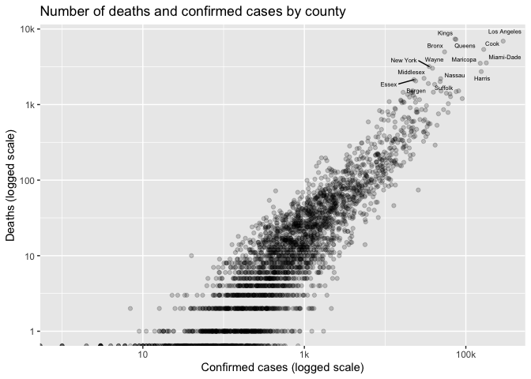
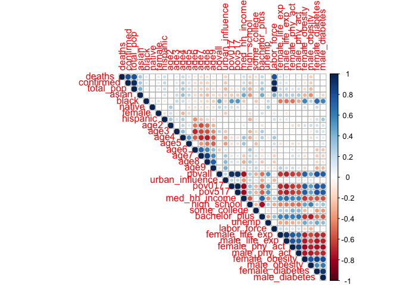
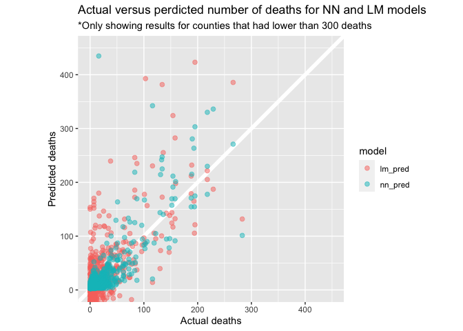

Final\_project
================

``` r
library(tidyverse)
library(caret)
library(glmnet)
library(corrplot)
library(knitr)

covid <- read_csv("covid_cleaned.csv")
```

``` r
## Correlation between confirmed cases and deaths
# png("plots/deaths_confirmed.png", width = 8 , height = 6, units = "in", res = 300)

covid %>% 
  ggplot(aes(confirmed, deaths)) + 
  geom_point(alpha = 0.2) + 
  ggrepel::geom_text_repel(
    aes(label = county_name), 
    data = . %>% filter(confirmed > 100000 | deaths > 2000), 
    size = 2
  ) +
  scale_y_log10(
    labels = function(x) if_else(x < 1000, as.character(x), str_c(x/1000, "k"))
  ) + 
  scale_x_log10(
    labels = function(x) if_else(x < 1000, as.character(x), str_c(x/1000, "k"))
  ) + 
  labs(
    x = "Confirmed cases (logged scale)", 
    y = "Deaths (logged scale)", 
    title = "Number of deaths and confirmed cases by county"
  )
```

    ## Warning: Transformation introduced infinite values in continuous y-axis

    ## Warning: Transformation introduced infinite values in continuous x-axis

<!-- -->

``` r
# dev.off()
```

### Preparing data to fit the models

``` r
state_dummified <- 
  covid %>% 
  filter(!is.na(total_pop)) %>%
  mutate(state = str_to_lower(state) %>% str_replace_all(" ", "_")) %>% 
  sjmisc::to_dummy(state, suffix = "label") 

###Dividing into train, valid, test 
set.seed(1234)
covid_rand <- 
  cbind(covid %>% filter(!is.na(total_pop)), state_dummified) %>% 
  select(-fips, -county_name, -state) %>% 
  filter_all(~ !is.na(.)) %>% #Dropping all variables with NAs 
  mutate_at(vars(-deaths, -starts_with("state")), scale) %>% #feature scaling
  mutate(
    group = 
      sample(c(1, 2, 3), size = nrow(.), prob= c(0.6, 0.2, 0.2), replace = TRUE), 
  )
  
#train
train <- covid_rand %>% filter(group == 1) %>% select(-group) 
train_x <- covid_rand %>% filter(group == 1) %>% select(-group, -deaths) 
train_y <- covid_rand %>% filter(group == 1) %>% pull(deaths)

#validation
valid <- covid_rand %>% filter(group == 2) %>% select(-group) 
valid_x <- covid_rand %>% filter(group == 2) %>% select(-group, -deaths)
valid_y <- covid_rand %>% filter(group == 2) %>% pull(deaths)

#test
test <- covid_rand %>% filter(group == 3) %>% select(-group) 
test_x <- covid_rand %>% filter(group == 3) %>% select(-group, -deaths)
test_y <- covid_rand %>% filter(group == 3) %>% pull(deaths)
```

### Correlations among all variables

``` r
df_plotting <- 
  covid %>% 
  select(deaths, confirmed, everything(), -fips, -county_name, -state, -starts_with("mort"))
  
# png("plots/correlations.png", width = 8 , height = 6, units = "in", res = 300)

p <- cor(df_plotting)
corrplot(p, type = 'upper')
```

<!-- -->

``` r
# dev.off()
```

### Linear model

``` r
lm_fit <- lm(deaths ~ ., data = train)
```

### Linear model with interactions

``` r
lm_inter_fit <- lm(deaths ~ . + .:., data = train)
```

### Neural Network

``` r
library(keras)

#input shape of x train 
input_shape <- ncol(train_x)
lambda = 0.03
units = 25

##Specifying model architecture
nn_model <-
  keras_model_sequential() %>% 
  layer_dense(input_shape = input_shape, units = 25, activation = "relu") %>% 
  layer_dense(
    units = 25, activation = "relu",
    kernel_regularizer = regularizer_l1_l2(l1 = lambda, l2 = lambda)
    ) %>%
  layer_dense(
    units = 25, activation = "relu",
    kernel_regularizer = regularizer_l1_l2(l1 = lambda, l2 = lambda)
    ) %>%
  layer_dense(
    units = 25, activation = "relu",
    kernel_regularizer = regularizer_l1_l2(l1 = lambda, l2 = lambda)
    ) %>%
  layer_dense(
    units = 25, activation = "relu",
    kernel_regularizer = regularizer_l1_l2(l1 = lambda, l2 = lambda)
    ) %>%
  layer_dense(
    units = 25, activation = "relu",
    kernel_regularizer = regularizer_l1_l2(l1 = lambda, l2 = lambda)
    ) %>%
  layer_dense(
    units = 25, activation = "relu",
    kernel_regularizer = regularizer_l1_l2(l1 = lambda, l2 = lambda)
    ) %>%
  layer_dense(
    units = 25, activation = "relu",
    kernel_regularizer = regularizer_l1_l2(l1 = lambda, l2 = lambda)
    ) %>%
  layer_dense(
    units = 25, activation = "relu",
    kernel_regularizer = regularizer_l1_l2(l1 = lambda, l2 = lambda)
    ) %>%
  layer_dense(
    units = 25, activation = "relu",
    kernel_regularizer = regularizer_l1_l2(l1 = lambda, l2 = lambda)
    ) %>%
  layer_dense(
    units = 25, activation = "relu",
    kernel_regularizer = regularizer_l1_l2(l1 = lambda, l2 = lambda)
    ) %>%
  layer_dense(1, activation = "linear")

summary(nn_model)
```

    ## Model: "sequential"
    ## ________________________________________________________________________________
    ## Layer (type)                        Output Shape                    Param #     
    ## ================================================================================
    ## dense_11 (Dense)                    (None, 25)                      2400        
    ## ________________________________________________________________________________
    ## dense_10 (Dense)                    (None, 25)                      650         
    ## ________________________________________________________________________________
    ## dense_9 (Dense)                     (None, 25)                      650         
    ## ________________________________________________________________________________
    ## dense_8 (Dense)                     (None, 25)                      650         
    ## ________________________________________________________________________________
    ## dense_7 (Dense)                     (None, 25)                      650         
    ## ________________________________________________________________________________
    ## dense_6 (Dense)                     (None, 25)                      650         
    ## ________________________________________________________________________________
    ## dense_5 (Dense)                     (None, 25)                      650         
    ## ________________________________________________________________________________
    ## dense_4 (Dense)                     (None, 25)                      650         
    ## ________________________________________________________________________________
    ## dense_3 (Dense)                     (None, 25)                      650         
    ## ________________________________________________________________________________
    ## dense_2 (Dense)                     (None, 25)                      650         
    ## ________________________________________________________________________________
    ## dense_1 (Dense)                     (None, 25)                      650         
    ## ________________________________________________________________________________
    ## dense (Dense)                       (None, 1)                       26          
    ## ================================================================================
    ## Total params: 8,926
    ## Trainable params: 8,926
    ## Non-trainable params: 0
    ## ________________________________________________________________________________

``` r
##Compiling the model
nn_model %>% 
  compile(
    loss = "mean_squared_error",
    optimizer = "adam",
    metrics = c("mse", "mae")
  )

##Running the model 
history <- 
  fit(
    object = nn_model, 
    x = as.matrix(train_x), 
    y = train_y,
    batch_size = 200, 
    epochs = 500
  )
```

### KNN regression

``` r
ctrl <- trainControl(method = "none", number = 10, savePredictions = TRUE)

knn_model <- 
  train(
    deaths ~ ., 
    data = train,
    method = "knn",
    trControl = ctrl,
    metric = "RMSE"
  )
```

### Lasso regression

``` r
lasso_fit <- cv.glmnet(as.matrix(train_x), train_y, alpha = 1)
```

### Ridge regression

``` r
ridge_fit <- cv.glmnet(as.matrix(train_x), train_y, alpha = 0)
```

### MSE on training set

``` r
train %>% 
  mutate(
    lm_pred = predict(lm_fit, train_x),
    lm_sqr_error = (deaths - lm_pred)^2,
    ilm_pred = predict(lm_inter_fit, train_x),
    ilm_sqr_error = (deaths - ilm_pred)^2,
    nn_pred = predict(nn_model, as.matrix(train_x)),
    nn_sqr_error = (deaths - nn_pred)^2,
    knn_pred = predict(knn_model, train_x),
    knn_sqr_error = (deaths - knn_pred)^2,
    lasso_pred = predict(lasso_fit, as.matrix(train_x)),
    lasso_sqr_error = (deaths - lasso_pred)^2,
    ridge_pred = predict(ridge_fit, as.matrix(train_x)),
    ridge_sqr_error = (deaths - ridge_pred)^2,
  ) %>% 
  summarize_at(vars(ends_with("sqr_error")), mean, na.rm = TRUE) %>% 
  kable()
```

| lm\_sqr\_error | ilm\_sqr\_error | nn\_sqr\_error | knn\_sqr\_error | lasso\_sqr\_error | ridge\_sqr\_error |
| -------------: | --------------: | -------------: | --------------: | ----------------: | ----------------: |
|       12973.93 |               0 |       151.7315 |        13197.97 |           23035.3 |          22766.48 |

### MSE on validation set

``` r
valid %>% 
  mutate(
    lm_pred = predict(lm_fit, valid),
    lm_sqr_error = (deaths - lm_pred)^2,
    ilm_pred = predict(lm_inter_fit, valid_x),
    ilm_sqr_error = (deaths - ilm_pred)^2,
    nn_pred = predict(nn_model, as.matrix(valid_x)),
    nn_sqr_error = (deaths - nn_pred)^2,
    knn_pred = predict(knn_model, valid_x),
    knn_sqr_error = (deaths - knn_pred)^2,
    lasso_pred = predict(lasso_fit, as.matrix(valid_x)),
    lasso_sqr_error = (deaths - lasso_pred)^2,
    ridge_pred = predict(ridge_fit, as.matrix(valid_x)),
    ridge_sqr_error = (deaths - ridge_pred)^2,
  ) %>% 
  summarize_at(vars(ends_with("sqr_error")), mean, na.rm = TRUE) %>% 
  kable()
```

| lm\_sqr\_error | ilm\_sqr\_error | nn\_sqr\_error | knn\_sqr\_error | lasso\_sqr\_error | ridge\_sqr\_error |
| -------------: | --------------: | -------------: | --------------: | ----------------: | ----------------: |
|       100108.7 |     10238771408 |       59324.96 |        157374.6 |          128633.9 |          153460.8 |

### MSE of the final model on test set

``` r
test %>% 
  mutate(
    nn_pred = predict(nn_model, as.matrix(test_x)),
    nn_sqr_error = (deaths - nn_pred)^2,
  ) %>% 
  summarize_at(vars(ends_with("sqr_error")), mean, na.rm = TRUE) %>% 
  kable()
```

| nn\_sqr\_error |
| -------------: |
|       9806.204 |

### Error Analysis for the neural network model

``` r
valid %>% 
  mutate(
    nn_pred = predict(nn_model, as.matrix(valid_x)),
    diff = abs(deaths - nn_pred)
  ) %>% 
  select(deaths, nn_pred, diff, everything()) %>% 
  arrange(desc(diff)) %>% 
  slice(1:100) %>% 
  write_csv("error_analysis.csv")
```

### Tuning number of units for the Neural Network

``` r
#input shape of x train 
input_shape <- ncol(train_x)
lambda <- 0.03

##Specifying model architecture

testing_units <- function(units) {
  nn_model <-
    keras_model_sequential() %>% 
    layer_dense(
      input_shape = input_shape, 
      units = units, 
      activation = "relu", #change to linear
      kernel_regularizer = regularizer_l1_l2(l1 = lambda, l2 = lambda)
    ) %>% 
    layer_dense(
      units = units, activation = "relu", 
      kernel_regularizer = regularizer_l1_l2(l1 = lambda, l2 = lambda)
    ) %>% 
    layer_dense(
      units = units, activation = "relu", 
      kernel_regularizer = regularizer_l1_l2(l1 = lambda, l2 = lambda)
    ) %>%
    layer_dense(
      units = units, activation = "relu", 
      kernel_regularizer = regularizer_l1_l2(l1 = lambda, l2 = lambda)
    ) %>% 
    layer_dense(
      units = units, activation = "relu", 
      kernel_regularizer = regularizer_l1_l2(l1 = lambda, l2 = lambda)
    ) %>% 
    layer_dense(
      units = units, activation = "relu", 
      kernel_regularizer = regularizer_l1_l2(l1 = lambda, l2 = lambda)
    ) %>% 
    layer_dense(
      units = units, activation = "relu", 
      kernel_regularizer = regularizer_l1_l2(l1 = lambda, l2 = lambda)
    ) %>% 
    layer_dense(1, activation = "linear")
  
  summary(nn_model)
  
  ##Compiling the model
  nn_model %>% 
    compile(
      loss = "mean_squared_error",
      optimizer = "adam",
      metrics = c("mse", "mae")
    )
  
  ##Running the model 
  history <- 
    fit(
      object = nn_model, 
      x = as.matrix(train_x), 
      y = train_y,
      batch_size = 200, 
      epochs = 100
    )
  
  valid %>% 
    mutate(
      nn_pred = predict(nn_model, as.matrix(valid_x)),
      nn_sqr_error = (deaths - nn_pred)^2,
    ) %>% 
    summarize_at(vars(ends_with("sqr_error")), mean, na.rm = TRUE) %>% 
    mutate(units = units)
  
}

seq(5, 35, 5) %>% 
  map_dfr(testing_units)
```

### Comparing linear model versus using neural network

``` r
# png("plots/lm_vs_nn.png", width = 8 , height = 8, units = "in", res = 300)

valid %>% 
  select(deaths) %>% 
  mutate(
    lm_pred = predict(lm_fit, valid_x),
    nn_pred = predict(nn_model, as.matrix(valid_x))
  ) %>% 
  filter(deaths < 300) %>% 
  rowid_to_column() %>% 
  gather(key = model, value = pred, -deaths, -rowid) %>% 
  ggplot(aes(deaths, pred, color = model)) + 
  geom_abline(slope = 1, intercept = 0, color = "white", size = 2) + 
  geom_point(alpha = 0.5, size = 2) + 
  coord_fixed(ylim = c(0, 450), xlim = c(0, 450)) + 
  labs(
    x = "Actual deaths", 
    y = "Predicted deaths",
    title = "Actual versus perdicted number of deaths for NN and LM models", 
    subtitle = "*Only showing results for counties that had lower than 300 deaths"
  )
```

    ## Warning: Problem with `mutate()` input `lm_pred`.
    ## ℹ prediction from a rank-deficient fit may be misleading
    ## ℹ Input `lm_pred` is `predict(lm_fit, valid_x)`.

    ## Warning in predict.lm(lm_fit, valid_x): prediction from a rank-deficient fit may
    ## be misleading

    ## Warning: attributes are not identical across measure variables;
    ## they will be dropped

<!-- -->

``` r
# dev.off()
```
